<h2 align="left">Hi 👋! My name is Agniva Mukherjee and I'm a final-year engineering student, India, focused on building scalable software in cloud, AI, and embedded systems.</h2>

###

 

<!-- ✅ Working GitHub Streak Graph -->

  
  
  

  

 <!-- ✅ GitHub Activity Graph -->

  

###

 

###

  
  
  
  
  
  
  
  
  
  
  
  
  
  
  
  
  
  
  
  
  
  
  
  
  
  
  
  
  
  
  

###

 

  
  
  
  
  
  
  
  
  

###

 

